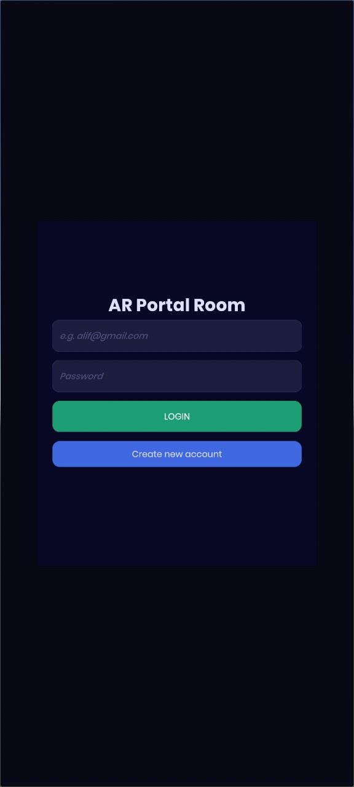
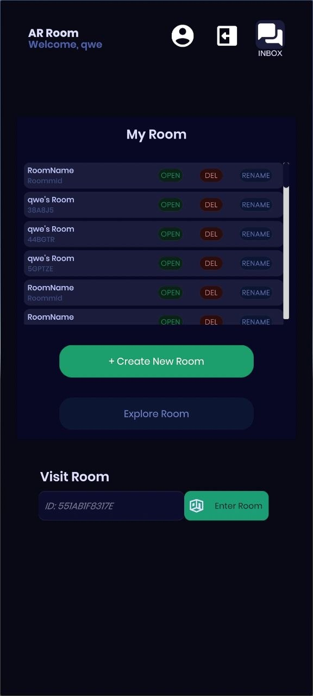
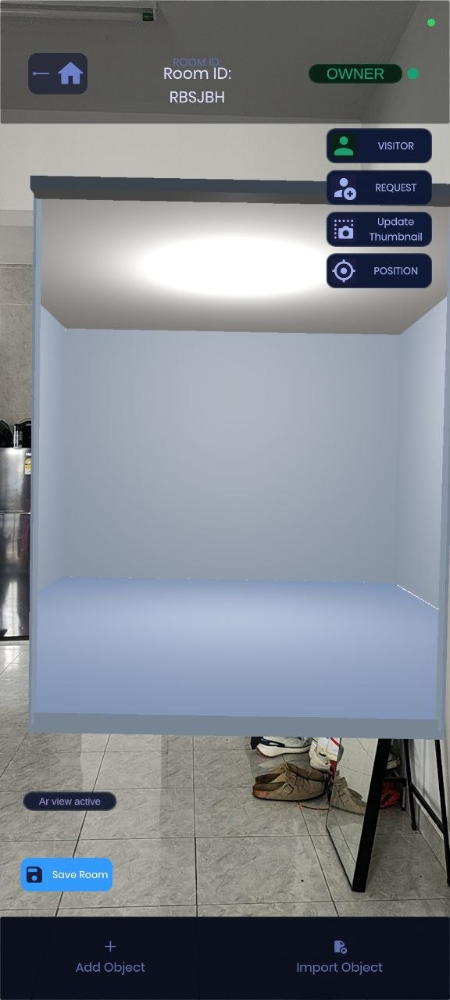
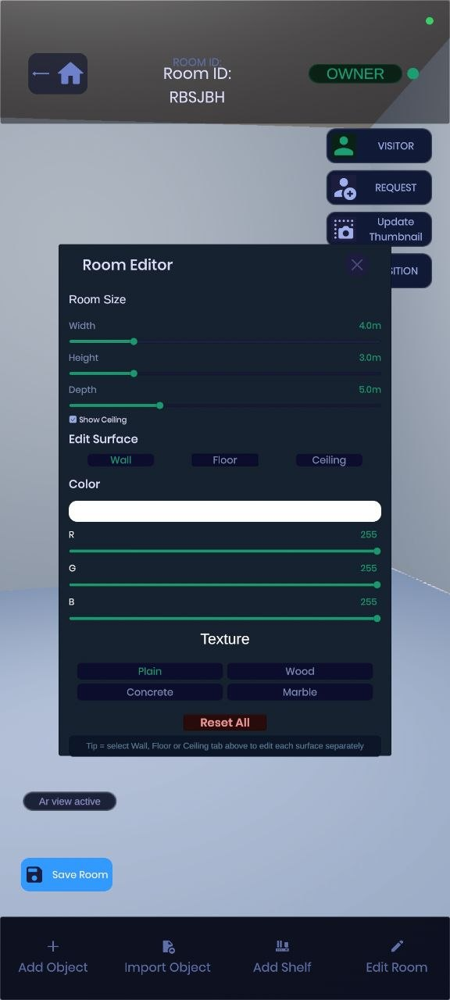
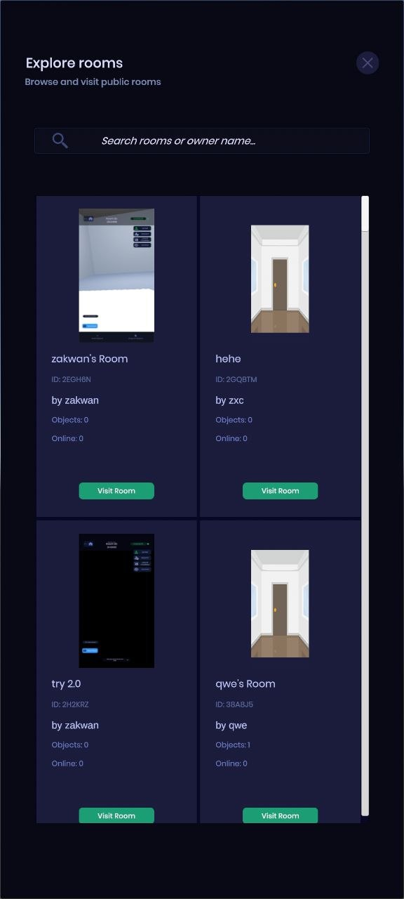

# AR Personal Portal Room 🚪

An Android Augmented Reality (AR) application developed using Unity that allows users to create, customize, and interact with a virtual room through an AR portal experience.

The system enables users to visualize and organize their 3D collections by placing digital objects inside a personalized virtual space.

---

## 📌 Project Overview

AR Personal Portal Room is a Final Year Project developed to provide collectors with an immersive way to store and visualize their collections digitally.

Users can create customizable virtual rooms, place 3D objects, modify room environments, and access their rooms through an AR portal placed in the real world.

---

## ✨ Features

### 🔐 User Management
- User registration and login using Firebase Authentication
- Secure user authentication

### 🚪 AR Portal Room System
- Real-world AR portal placement
- Enter and explore a virtual room through the portal
- Immersive AR room experience

### 🏠 Room Customization
- Create customizable virtual rooms
- Modify room appearance
- Change wall, floor, and ceiling settings
- Select different room templates

### 📦 3D Object Management
- Place built-in 3D objects
- Import external GLB models
- Move, rotate, and scale objects
- Delete objects
- Manage object information through metadata

### 🌐 Room Management
- Save and load room configurations
- Owner and visitor room access
- Explore available rooms

---

## 🛠 Technologies Used

| Technology | Purpose |
|---|---|
| Unity 6 (6000.3.10f1) | Application development |
| C# | Programming language |
| AR Foundation | AR functionality |
| Google ARCore | Android AR support |
| Firebase Authentication | User authentication |
| Firebase Realtime Database | Data management |
| Blender / GLB Models | 3D asset preparation |

---

# 📱 Screenshots

## Login Interface

## Home Screen

## AR Portal Room

## Room Customization

## Explore Room

---

## ⚙️ Requirements

### Software
- Unity 6000.3.10f1
- Android Build Support
- Firebase SDK

### Hardware
- Android device with ARCore support

---

## 🚀 How to Run

1. Clone this repository
git clone https://github.com/yourusername/ar-personal-portal-room.git

2. Open the project using Unity Hub

3. Install required Unity modules:
- Android Build Support
- AR Foundation package

4. Configure Firebase:

Place your own:
google-services.json

inside the required Firebase directory.

5. Build and run the application on an ARCore-supported Android device.

---

## 👨‍💻 Author

**Alif Zakwan Bin Azman**

Software Engineering Student  
Universiti Kebangsaan Malaysia (UKM)
